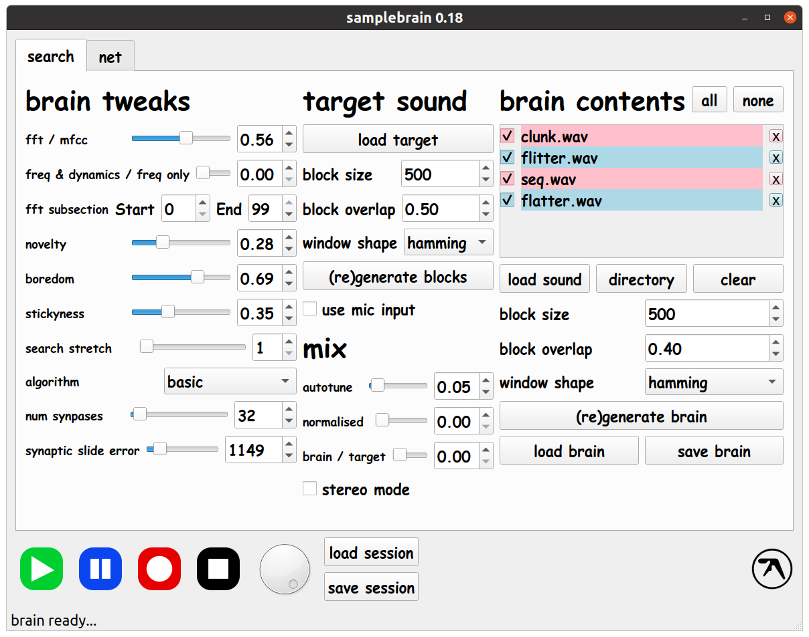

# Samplebrain

A custom sample mashing app designed by Aphex Twin.

Samplebrain chops samples up into a 'brain' of interconnected small
sections called blocks which are connected into a network by
similarity. It processes a target sample, chopping it up into blocks
in the same way, and tries to match each block with one in its brain
to play in realtime.

This allows you to interpret a sound with a different one. As we
worked on it (during 2015 and 2016) we gradually added more and more
tweakable parameters until it became slightly out of control.

# Quick start:

1. Load a bunch of short wav files into the brain
2. Click (re)generate brain
3. Load a short loop sample into the target
4. Click (re)generate blocks
5. Press play
6. Tweak brain

Larger wav files like whole tracks can be used, but take a long time
to process, after which they can be saved as "brain" files and
instantly reloaded.

# How do I use this thing?

Check the [Manual](docs/manual.md) here for the details on all the
parameters and try out the [demo brain session](https://static.thentrythis.org/samplebrain/demo.samplebrain).

Load the demo using "load session" not "load brain" (sessions contain
both the target and brain samples). The original samples used to
create the demo session [can be found here for
testing](https://static.thentrythis.org/samplebrain/samples/).

# Download

As this is experimental non-commercial software (only originally
written to run on a couple of computers!) you will have to bear with
us as we gradually stabilise things based on your feedback. There
might currently be problems running it on 64bit Windows.
            
* **Windows**: [samplebrain_0.18.4_win.zip](https://static.thentrythis.org/samplebrain/samplebrain_0.18.4_win.zip)
* **Mac (intel/m1)**: [samplebrain_0.18.4_macintel.zip](https://static.thentrythis.org/samplebrain/samplebrain_0.18.4_macintel.app.zip)

Changes in 0.18.4: New audio device settings window and updated
windows build. Better default block size, tool tip tweaks and fixes
for dark themes by [Claude Heiland-Allen](https://mathr.co.uk/).

For old versions see the [changelog](changelog.md)
    
Mac note: As this software is not on the apple store, to run the
binary you need to tell your mac it's ok: Go to System Preferences >
Security & Privacy > General. At the bottom of the window, select
"Allow apps to be downloaded from Anywhere".

Thank you to [Nik Gaffney](http://fo.am) for help with the Apple
builds. 
        
# Linux install

#### Ubuntu
    $ sudo add-apt-repository ppa:thentrythis/samplebrain
    $ sudo apt update
    $ sudo apt install samplebrain

If you'd like the right font, optionally:

    $ sudo apt install ttf-mscorefonts-installer

# [Building from source](building.md)                

MFCC algo courtesy of the Aquila library by Zbigniew Siciarz MIT/X11
licence 2007-2014 (see brain/src/aquila/LICENCE)

This program is free software licenced under GNU General Public
License version 2 (see LICENCE).

Written by [Dave Griffiths at Then Try This](http://thentrythis.org).

## Links

To find related tech like [CataRT](https://ircam-ismm.github.io/max-msp/catart.html), [bbcut2](https://composerprogrammer.com/bbcut2.html), [eargram](https://sites.google.com/site/eargram/) and [sCrAmBlEd?HaCkZ!](https://www.youtube.com/watch?v=eRlhKaxcKpA) search up [granular synthesis](http://granularsynthesis.com/guide.php), [concatenative synthesis](https://hal.archives-ouvertes.fr/hal-01161337), [neural audio synthesis](https://github.com/acids-ircam/RAVE), [sinewave speech](http://www.lifesci.sussex.ac.uk/home/Chris_Darwin/SWS/), automated breakbeat cutting, audio mosaicing and plunderphonics/plundermatics.
