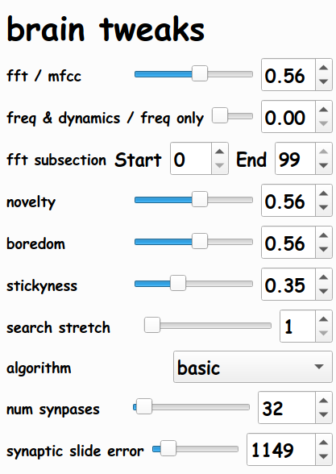
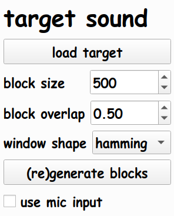
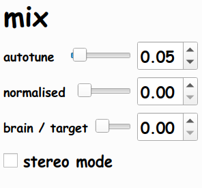
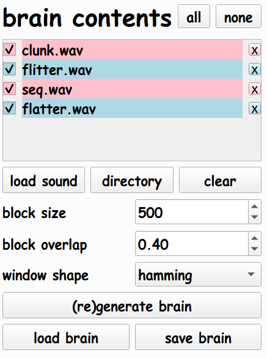

# Samplebrain Manual

A custom sample mashing app designed by Aphex Twin.

Samplebrain chops samples up into a 'brain' of interconnected small
sections called blocks which are connected into a network by
similarity. It processes a target sample, chopping it up into blocks
in the same way, and tries to match each block with one in it's brain
to play in realtime.

This allows you to interpret a sound with a different one. Over time
developing it, we gradually added more and more tweakable parameters
until it became slightly out of control.    
            
## Brain tweaks:

    
These settings control how the block search works.
    
### fft / mfcc

Choose whether to match blocks using FFT (raw frequency analysis) or
MFCC (Mel-frequency cepstral coefficients, parameters that attempt to
model perception of sound). Which is best depends on the sounds you
are using, so you can blend between them to use a mix. Setting this to
0% or 100% switches off the other search option, so is a bit more CPU
friendly.
   
### freq & dynamics / freq only

Search using both frequency (pitch) and dynamics (volume changes over
time), or only frequency - which uses normalised blocks. Generally you
want the first option.
   
### fft subsection

You can select a subrange of the (100) frequency bins we use for
scoring potential blocks, potentially allowing you to target a
specific frequency range. Not that useful in practice so far.
     
### novelty

Often the same block or set of blocks tend to be overused if there
isn't enough variation in the brain. You can use 'novelty' to bias the
selection away from similarity, and prioritise similar blocks we
haven't used yet.
    
### boredom

This increases the speed at which novelty wears off, creating a wider
spread of possible blocks to be used.

If you turn novelty and boredom all the way up it will ignore the
target completely and just play brain samples in some odd semi-random
order.
    
### stickyness

If the error of the next block in the sequence after the one we have
just used is under the stickyness threshold, we will use that rather
than the closest in our search. This will have the effect of
elongating chunks of brain samples that you hear.
    
### search stretch

Repeats blocks in the target a fixed amount, like a simple timestretch
- using the above controls it won't necessarily repeat the same brain
block, and in synaptic mode (see below) this gives the system repeated
attempts to find a closer match in the network.
        
### algorithm

_basic_

Searches all sample blocks. Not usable with large brains.
    
_reversed_

Searches all samples in the brain, but selects the least closest match
instead of the closest. In practice this needs work, as silent or very
quiet blocks tend to be the least similar.

_synaptic_

As brains get larger with more blocks, they get slower to search. This
mode provides a constant search time over arbitrarily large brains. To
do this we connect the blocks together into a network via similarity
(via connections called synapses). We store a current "playback
position" in the network and only search the nearby blocks the playing
block is connected to. This assumes that sounds tend to change
gradually, or at least more gradually than the smaller block lengths.

This can leads to the output changing with each repetition of the
target, as we wander around the synapse network.
        
_slide_

Similar to synaptic mode above but if we can't find a close enough
match (based on synaptic slide error) we repeat the target block
again, stretching it until we land on a block that is close
enough. This mode unpredictably warps the timing of the target sound.

### num synapses

How many connections to check in synaptic or slide mode, up to a
maximum of 1000 - they are ordered by closeness.
    
### synaptic slide error

The acceptable error to consider a block as "close enough" in slide mode.

## Target sound:

These settings control how the target sound is broken up into blocks.
    
### load target

Load a target sound to try and match
    
### block size

The size of the blocks in samples. This does not need to match the
brain block size.

### block overlap

Proportion to overlap the block generation.
     
### window shape

The windowing function for the target blocks, the volume shape given
to them before use - "dodgy" is actually rectangle, so no shaping.

### (re)generate blocks

Compute the target blocks.
    
### use mic input

Attempts to stream blocks live from the microphone. This has not been
tested fully.

## Mix:

    
These are settings that control things happening after the search.
    
### autotune

Attempt to pitch bend the chosen brain block to better match the target.
 
### normalised

Mix in normalised brain blocks - removing all dynamics. Designed to
work with frequency only search.
        
### brain / target

Mix in the target blocks to the output - for cheating, or testing
purposes.
    
### stereo mode

Run separate searches for left and right speaker.
    
## Brain contents

These settings allow you to build your sample brain, and switch in and
out specific samples live during playback.
        
### all/none

You can select which samples to use without regenerating the
brain. This selects all or none of the samples.
     
### load sound/directory/clear

Load sounds into the brain, either individually or entire directories
in one go.
    
### block size

The size of the blocks in samples. This does not need to match the
target block size.

### block overlap

Proportion to overlap the block generation.
     
### window shape

The windowing function for the brain blocks, the volume shape given
to them before use - "dodgy" is actually rectangle, so no shaping.

### (re)generate blocks

Compute the brain blocks.
    
### load brain/save brain

You can save and load brains separately to the targets.
    
## Lower bar

General playback settings.

### play/pause/record/stop

Start/stop and record.
 
### volume

Global volume.

### load/save session

Load and save the entire session.

## Net tab

This allows you to control multiple instances of samplebrain over the
network all running their own brains simultaneously. This feature has
not been tested well.

